<title>LIBERO × 视觉语言规划器 Direct-EEF 闭环实验报告</title>

# LIBERO × 视觉语言规划器：Direct-EEF 闭环实验报告

**实验窗口：** 2026-09-20 20:20 – 2026-09-21 20:30（UTC+8，约 24 小时）  
**机器：** WSL Linux，`conda activate libero`，`MUJOCO_GL=egl`，NVIDIA RTX 3080 Laptop  
**代码：**`/home/chener/LIBERO/astra_eval`  
**原始流水账：**`EXPERIMENT.md`　**回放页：**`viz/index.html`

---

## 0. 一页摘要

在官方 LIBERO 仿真里，用 **RGB + 语言指令 → 世界系笛卡尔目标** 的闭环（RoboProbe L3 / Direct-EEF）评估两个规划器：

| 规划器 | 入口 | 模型设定 |
|-|-|-|
| **Astra** | 本地 Codex CLI `codex exec -m gpt-6-astra` | `reasoning_effort=medium` |
| **Grok** | 本地 Grok CLI（后期为 nested `grok --prompt-file`） | 同一份 `PROMPT.txt`，同一座 HTTP 桥 |

**官方成功判据只有 `env.check_success()`。** 规划器看不到物体位姿、BDDL、深度或奖励。每条 episode 是 **一个 suite × 一个 task × 一个 init（init 0）**，不是官方 20-init 套件分。

截至 2026-09-22 12:40：

|  | 完成 episode | 官方成功 | 备注 |
|-|-|-|-|
| Astra | 18（含 harness / 额度 / resume） | **7** | 较昨日多 031 开灶成功；032 碗放盘额度中断 |
| Grok | 19（含 1 次用户中止） | **5** | 9-21 仅 029 开灶；9-22 grok-4.7 又拿到 033/034/037/038 |
| 合计归档 | 38 个 attempt + 2 个早期 named run | 12 成功 | `runs/attempt_*` + 两个早期 named run |

**三句话结论：**

1. 同一座桥、同一套相机约定下，Astra 能在厨房桌面（碗、抽屉、灶）和地面（番茄酱瓶颈）上完成接触级闭环；grok-4.7 在 goal 抽屉/灶/碗上也拿到了官方成功。
2. 失败几乎都发生在 **夹爪缝是否包住物体**，而不是语言理解：两个模型都能点名正确物体，并做 +x 探针确认图像方向。
3. 世界坐标轴叠加（`LIBERO_WORLD_AXES=1`）能稳住轴向符号、帮助灶具这类「高度 + 绕 z 转动」任务；它 **不** 替代腕部缝隙对齐，也 **不** 告诉模型抽屉把手该用 roll 还是 yaw。

---

## 1. 实验配置

### 1.1 问题设定

能否只靠两路 RGB 和语言指令，让一个通用视觉语言模型以 **绝对世界系笛卡尔目标** 驱动 Panda，在 LIBERO 官方 `check_success()` 上闭环？

这是 **Direct-EEF**：没有 VLA 权重、没有示教、没有物体 6D、没有深度。观测是文件（`obs/agentview.png`、`obs/wrist.png`、`obs/state.json`），动作是 HTTP `POST /move`。

### 1.2 仿真与机器人

| 项 | 设定 |
|-|-|
| 环境 | `OffScreenRenderEnv`（LIBERO / robosuite 1.4） |
| 机器人 | Franka Panda，`OSC_POSE`，`control_delta=true`，20 Hz，动作维 7 |
| 插值 | 世界系直线段，约 0.05 m / 0.5 rad 每物理步，到达阈值 ≈ 1.2 cm |
| 夹爪命令 | `1` = 开，`0` = 关。Panda 底层 `+1` 闭合、`-1` 张开（本机核实后写进桥） |
| 预算 | 官方 600 env steps；规划器默认 30 次 `/move`，对照实验多为 25 |
| Init | 每个任务官方 50 个 init 中的 **id 0** |
| 随机种子 | `env.seed(0)` + `set_init_state(inits[0])`，reset 后再走 5 步零动作稳物理 |

### 1.3 评测的任务（全部 init 0）

| Suite | Task | 指令 | 场景高度 |
|-|-|-|-|
| `libero_spatial` | 0 | pick up the black bowl between the plate and the ramekin and place it on the plate | 厨房桌，home z≈1.17，桌面 ≈0.90 |
| `libero_spatial` | 1 | pick up the black bowl next to the ramekin and place it on the plate | 同上 |
| `libero_spatial` | 2 | pick up the black bowl from table center and place it on the plate | 同上 |
| `libero_spatial` | 3 | pick up the black bowl on the cookie box … | 同上（Grok 中途停下） |
| `libero_object` | 0 | pick up the alphabet soup and place it in the basket | 地面，home z≈0.26 |
| `libero_object` | 4 | pick up the ketchup and place it in the basket | 地面 |
| `libero_object` | 7 | pick up the milk and place it in the basket | 地面 |
| `libero_goal` | 0 | open the middle drawer of the cabinet | 厨房桌 |
| `libero_goal` | 7 | turn on the stove | 厨房桌 |
| `libero_goal` | 8 | put the bowl on the plate | 厨房桌 |

`libero_10` 未跑。

### 1.4 观测与坐标

规划器每步可读：

- **agentview** 256×256 RGB（第三人称）
- **wrist**`robot0_eye_in_hand` 256×256 RGB（眼在手上，fovy 75°）
- `state.json`：指令、suite/task/init、EEF xyz、相对 reset 的 roll/pitch/yaw（度）、`gripper_open`∈[0,1]、剩余预算、`success`、`terminated`、`feedback`

**不提供：** 物体名列表以外的几何、6D 位姿、深度、力、BDDL、reward。

图像保存约定与 OpenVLA / π0 的 LIBERO 评测一致：`img[::-1, ::-1]`。保存后：

- agentview：**机械臂在画面上方**，桌面/物体在下方
- wrist：**夹爪垫在画面底部**
- 世界 `/move` 的 xyz **不随 PNG 旋转翻转**

Agentview 轴向速查（写进 prompt）：

| 世界轴 | 在 agentview 上的表观 |
|-|-|
| +x | 夹爪移向画面 **底部**（远离躯干、深入工作区） |
| −x | 移向画面顶部（回到躯干） |
| +y | 画面 **左** |
| −y | 画面 **右** |
| +z | 升高（不是图像向上）；物体在腕部图里变小 |

腕部图「向上」**不是** 世界 +y。左右以 agentview 为准。

EEF 位姿是 MuJoCo/robosuite **世界系** 米：`robot0_eef_pos` 为 Panda `grip_site`，quat 为 eef body。厨房桌 home ≈ (−0.21, −0.01, 1.17)；地面套件 home ≈ (−0.15, −0.01, 0.26)。不要把厨房的 z 下限 0.82 用到地面（地面下限 ≈ 0.03）。

### 1.5 HTTP 桥（`bridge_server.py`）

单进程 `HTTPServer`（第一晚多线程把 EGL 相机打黑之后改回单线程），`127.0.0.1:8765`：

| 方法 | 作用 |
|-|-|
| `GET /status` | 刷新 `obs/*.png` 与 `state.json` |
| `POST /move` | 只改 JSON 里 **点名** 的轴；未点名的 xyz/rpy 保持当前值；未点名的 gripper 保持 **上一次命令**（不是模拟的 `gripper_open`） |
| `POST /give_up` | 规划器主动结束，需 `reason` / `hindsight` |

`/move` 回包带 `last_move`：点名轴、目标、`final_dist_m`、`stopped`∈{reached, blocked}、`feedback`。`feedback` 只有两类：

- `blocked/contact`：卡住，笛卡尔目标没到
- `ok` / `reset`：插值走完或开局

夹持是否成功 **只看图像 + `gripper_open`**。早期的 `empty_grasp_suspected` / `holding_or_pinching` 模板已删掉，避免规划器被字符串带跑。

每 20 Hz 控制步归档到 `runs/\<attempt>/ctrl/` 与 `steps.jsonl`（7 维动作 + 两路 RGB）。每个 `/move` 边界另存 `frames/`。

### 1.6 Prompt 与两套规划器入口

后期对照统一用 **`PROMPT_BASE_2.txt`**，`{{LESSONS}}` 替换成 “(no extra accumulated lessons)”。也就是：**不把上一局的战报灌进下一局**，只保留静态规则：

- 强制开局 +x 3 cm 探针，核对图像方向
- 闭合前在 note 里写 `close now would trap the object: yes/no`；只有腕部图里物体在 **两垫之间的缝** 才允许 `gripper=0`
- 平移前判断会不会撞；撞了先抬 / 改姿态
- 闭合后先 +z 2 cm 验夹，物体没起来立刻回去改 xy/z/pitch
- 取向每步最多 ±20°
- 真夹住之后每次 lift/transport **必须点名 `gripper=0`**

Astra 入口：`run_episode.sh` → `codex exec -m gpt-6-astra`，prompt 走 stdin（Codex `-i` 是可变参数，位置参数会被吃掉），只在开局把两张 reset 图用 `-i` 附上。后续观测靠读文件。

Grok 入口：`start_bridge.sh` 只起桥；策略进程是 Grok CLI。后期改为 nested：

```text
grok --prompt-file PROMPT.txt --always-approve --verbatim \
     --cwd /home/chener/LIBERO/astra_eval \
     --max-turns 250 --disallowed-tools Agent
```

两套规划器打同一座桥、同一套图像、同一份英文 prompt。全文中英对照见文末附录 A。改稿时间线见下一小节 1.6.1。

### 1.6.1 Prompt 改稿史：闭合检查与碰撞检查

飞书附录 A 是**终稿**。这两条规则不是一开始就有的，是 9-21 下午写进第 4 节、从 **attempt 019** 起才下发的。对后续执行提升最大的就是它们。

**三版（以各局归档的 PROMPT.txt 为准）**

| 版本 | 用在哪些局 | 要点 |
|-|-|-|
| 短稿 PROMPT_BASE.txt | 003–012 | 十条规则。有「包围物体才闭合」「真夹后点名 gripper=0」「先抬 2 cm」，**没有**闭合前 yes/no，**没有**平移前碰撞检查。 |
| 长稿 BASE_2，尚无两段门 | 013–018 | 坐标、探针、循环都在了。016 在第 8 节加了碗沿必须在两垫之间（碗专用）。闭合/平移仍没有强制自问。 |
| 长稿 + 两段门（现附录 A） | **019 起至今** | 第 4 节插入下面两段。019 的 EXPERIMENT.md 记为 close-check+collision。 |

**英文（019 起实际下发，第 4 节新增）**

```text
Before every gripper=0 close:
  Look at BOTH images and answer in the note: "close now would trap the object: yes/no".
  Yes only if the wrist shows the object body or rim in the gap BETWEEN the pads
  (not on top of a lip, not in the hollow, not beside one pad).
  If no, do NOT send gripper=0. Adjust xy / z / pitch / yaw first, then re-check the wrist.

Before every translate (x/y/z or dx/dy/dz):
  Look at both images and ask whether this motion would collide with the target,
  a neighbor, or the support.
  If the path would drive the wrist or pads through an object, do NOT send that target.
  Raise z a few centimetres and/or change pitch/yaw so the opening clears, then move.
  A blocked/contact on the previous call is a collision — do not repeat the same xyz.
```

**中文**

```text
每次 gripper=0 闭合前：
  看两张图，在 note 里回答："close now would trap the object: yes/no"。
  只有腕部图显示物体本体或沿在两垫之间的缝里才答 yes
  （不是压在薄沿上、不是在空腔里、不是只靠着一块垫）。
  若 no，不要发 gripper=0。先改 xy / z / pitch / yaw，再看腕部。

每次平移（x/y/z 或 dx/dy/dz）前：
  看两张图，问这次运动会不会撞到目标、邻居或支撑面。
  如果路径会让腕部或垫穿过物体，不要发这个目标。
  先抬几厘米 z 和/或改 pitch/yaw 让开口让开，再动。
  上一拍 blocked/contact 就是碰撞——不要重复同一个 xyz。
```

**加上之后发生了什么**

- 加上之前：015 两次 jaws-down 空抬；017 真夹牛奶后最后一步把张开和横移写在一起，掉在篮外。016 能成功，靠的是第 8 节碗专用「沿在两垫之间」，不是通用门。
- 加上之后（Astra）：020 番茄酱全程一次闭合，note 里 m06 写 close now: no、继续降，m10 才闭，官方成功。随后 goal 抽屉 024、碗 026、开灶 027/031 都在同一套门下完成。
- 规则卡住的是「先闭再看」和「直线穿物体」。它不保证释放（017 式最后一步仍可能把开爪和横移写在一起），也不保证 Grok 把腕部投影重叠当成可闭（021–023 空夹）。

### 1.7 世界坐标轴叠加（可选）

`LIBERO_WORLD_AXES=1` 时，桥在 **保存后的 PNG** 上画半透明世界 XYZ 三轴（α=0.5），**不往 MuJoCo 场景里加 geom**：

- +X 红，+Y 绿，+Z 蓝（图上 Z 偏橙）
- 原点在该相机光轴、画面中心附近
- agentview 相机位姿相对固定；wrist 每帧从 `robot0_eye_in_hand` 重读

投影按 robosuite OpenCV 外参（`diag(1,-1,-1)`）再补一次水平翻转，对齐 `img[::-1, ::-1]` 后的像素。

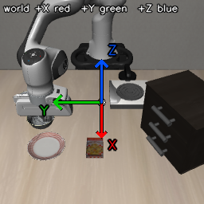

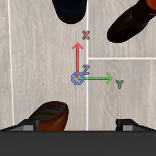

Prompt 里有一句：画面中心半透明 RGB 三轴是世界 +X/+Y/+Z，不是场景物体。

### 1.8 本报告怎么计「成功」

- **成功** = `result.json` 里 `success=true`，来源只有 LIBERO `check_success()`。
- 视觉上「看起来进篮子」不算（见 attempt_019）。
- harness 崩溃、Codex 额度、用户中止单独标注，不计入规划器能力，但列入时间线。
- 样本量是 **单 init 定性**，不能当成套件成功率。

---

## 2. 改进时间线

按墙钟顺序。每一段都改了「下一局规划器实际面对的世界」。

### 阶段 A · 把桥跑通（9-20 20:20–20:50）

| 时间 | Run | 发生了什么 |
|-|-|-|
| 20:22 | spatial0 attempt1 | `ThreadingHTTPServer` 在非 EGL 线程里 `/move`，相机变黑；夹爪符号反了。Astra 2 步放弃。 |
| 20:30 | spatial0 attempt2 | 单线程 + 夹爪符号修正。第一次真正的策略：四次同高度顶视闭合，碗不起。 |
| 20:39 | attempt_003 | 未点名的 rpy 被调节逻辑拧腕；Codex 退出。 |
| 20:48 | attempt_004 | 打开 pitch。侧壁夹到了，但 6–7 cm 一次抬起，捏滑。 |
| **20:57** | **attempt_005** | **Prompt：先 2 cm 验夹、取向 ±20°/步、没起来不准运。官方成功。** 15° 侧壁，短抬，再抓，放到盘上。 |

这是第一晚的核心控制课：**接触精度，不是语义。** 碗在盘和烤盅之间能被认出来；失败在闭合高度和抬升幅度。

### 阶段 B · 把课写进 LESSONS，并开始对照 Grok（9-20 21:00–9-21 00:10）

| 时间 | Run | 发生了什么 |
|-|-|-|
| 21:09 | attempt_006 spatial/1 | 真夹到 g≈0.71，但后续 `/move`**没点名 gripper=0**，桥按「保持上次命令」把爪打开。碗被推走。 |
| 21:18 | attempt_007 spatial/2 | Codex ChatGPT 额度用尽，7 步中断，爪停在灶上。 |
| 23:09–00:10 | Grok 008–010 | 同一套 spatial 0/1/2。Grok 在 t0 **夹起过碗**，运到盘边却 **30 步内从未张开**；t1/t2 是连续空夹。 |

新规则进 `LESSONS.md`：真夹之后每次都写 `gripper=0`；腕部充满 ≠ 接触；空夹 g≈0.02 要改 xy，不要沿 +x 追沿。

### 阶段 C · 图像约定、PROMPT_BASE_2、地面套件（9-21 上午–下午）

| 时间 | 改动 |
|-|-|
| 上午 | PNG **固定**`img[::-1, ::-1]`。Prompt 描述「臂在上、桌在下」，不再对规划器讲 rot180 实现细节。 |
| 上午 | `ctrl/` + `steps.jsonl`：20 Hz 全轨迹，支持 resume 重放物理。 |
| 11:15 | Grok object/7 牛奶：识别对了，一次 g=0.17 屋脊捏，2 cm 抬空。 |
| 11:47 | **PROMPT_BASE_2、不注入 LESSONS、15 步预算** 的公平对照。Grok 把 Farmers Cheese 当成牛奶。 |
| 11:54 | Astra 同样 BASE_2：GET `/status` 后直接退出（014）。 |
| 12:03 | Astra 015：留在循环里，但全程 jaws-down，两次空抬，15 步不够。 |
| 14:36 | **Astra 016**：BASE_2 静态「碗沿必须在两垫之间」+ 25 步。15° 侧壁，一次闭合就夹住，19 步成功。 |
| 14:47–15:21 | 地面：牛奶（017 夹起，最后一步在篮子旁张开）、resume 018 侧倒纸盒再抓失败、字母汤 019 **视觉在篮内但官方 success=false**。 |
| **15:37** | **Astra 020 番茄酱成功**：瓶颈 g≈0.42，2 cm 验夹，放入篮子。 |

016 说明：哪怕不注入上一局战报，只要 prompt 把「缝里才闭合」写死，Astra 能在 spatial/0 上复现成功，而且比 005 更干净（19 vs 29 步）。

019 是评测课：官方 checker 比「看起来在篮里」更严。规划器不能自己宣布成功。

### 阶段 D · Grok 对照番茄酱 + 世界轴（9-21 16:00–17:10）

| 时间 | Run | 轴 | 结果 |
|-|-|-|-|
| 16:03 | Grok 021 | 关 | 两次空夹 g=0.05，闭合时 x≈−0.018（成功抓大约在 x≈−0.11，差 \~9 cm） |
| 16:33 | Grok 022 | **仅 agentview** | +x 探针与红轴一致；仍两次空夹，在 y 上振荡 |
| 17:07 | Grok 023 nested CLI | **双相机** | 腕部图里瓶子「在垫柱之间」其实在指尖前方（世界 +x），仍空夹 |

世界轴解决了「+x 是不是画面底部」；没有解决「腕部图里的色块是不是夹缝里的物体」。

### 阶段 E · Goal 套件与坐标轴对照（9-21 17:40–20:30）

| 时间 | Run | 任务 | 轴 | 结果 |
|-|-|-|-|-|
| 17:40 | Astra 024 | 开中层抽屉 | 关 | **成功**。roll 分五步到 −90°，横杆进缝，g≈0.23，+y 拉出 |
| 17:49 | Astra 025 | 开灶 | 关 | 三次空夹，闭合高度偏高（z≈1.00 / 0.97），give_up |
| 17:58 | Astra 026 | 碗放盘 | 关 | **成功**。两次空夹后第三次侧壁捏住 |
| **18:07** | **Astra 027** | **开灶（025 的同 init 重试）** | **双相机开** | **成功**。浅夹一次后在 z≈0.955、g≈0.32 咬住，−yaw 转到 −44° |
| 20:08 | Grok 028 | 开中层抽屉 | 双相机开 | 失败。用 **yaw 90°** 正对横杆，空夹；成功姿态是 **roll −90°** |
| **20:18** | **Grok 029** | **开灶** | **双相机开** | **Grok 本窗口唯一官方成功**。z≈0.963、g≈0.31，三次 −20° yaw |
| 20:18– | Grok 030 | 碗放盘 | 双相机开 | **已结束：唇沿空夹失败**（已约 19 步，尚未闭合） |

---

### 阶段 F · grok-4.7 重跑 goal，开轴 / 关轴各一轮（9-22 10:23–12:40）

同一 PROMPT_BASE_2、不注入 LESSONS、25 步。nested 策略标明 grok-4.7。

| 时间 | Run | 任务 | 轴 | 结果 |
|-|-|-|-|-|
| 10:23 | Grok 033 | 开中层抽屉 | 开 | 成功。roll ≈ −90°，g≈0.23，+y 拉出（028 用错过 yaw 90°） |
| 10:45 | Grok 034 | 开灶 | 开 | 成功。z≈0.962，g≈0.31，−yaw 到 −49° |
| 11:27 | Grok 035 | 碗放盘 | 开 | 否。侧壁夹住并运到盘边，25 步用尽从未张开 |
| 12:12 | Grok 036 | 开中层抽屉 | 关 | 否。roll 走到 −90 后空夹，姿态拧到 roll≈175° |
| 12:22 | Grok 037 | 开灶 | 关 | 成功。与 029 几乎同路径，15 步，yaw≈−54° |
| 12:39 | Grok 038 | 碗放盘 | 关 | 成功。15° 侧壁，g≈0.04，18 步放到盘上 |

## 3. 实验结果

### 3.1 全表

成功标 **是**；中断单独写原因。墙钟为归档时间（UTC+8）。

| Run | 规划器 | 任务 | 轴 | 成功 | 步数 / 物理步 | 墙钟 | 要点 |
|-|-|-|-|-|-|-|-|
| att.1 | Astra | spatial/0 | — | 中断 | 2 / 27 | 2.3 min | EGL 线程 + 夹爪反号 |
| att.2 | Astra | spatial/0 | — | 否 | 24 / 373 | 6.0 min | 四次同高顶视空夹 |
| 003 | Astra | spatial/0 | — | 中断 | 1 / 17 | — | 未点名 rpy 拧腕 |
| 004 | Astra | spatial/0 | — | 否 | 27 / 426 | 6.5 min | 侧壁夹到，一次抬太高滑掉 |
| **005** | Astra | spatial/0 | — | **是** | **29 / 466** | **5.9 min** | 2 cm 验夹 + 再抓放置 |
| 006 | Astra | spatial/1 | — | 否 | 28 / 377 | 6.6 min | 真夹被未点名 gripper 打开 |
| 007 | Astra | spatial/2 | — | 额度 | 7 / 125 | 2.1 min | Codex usage limit |
| 008 | Grok | spatial/0 | — | 否 | 30 / 391 | 25.5 min | 夹起运到盘，**从未张开** |
| 009 | Grok | spatial/1 | — | 否 | 26 / 302 | 28.8 min | 8 次空夹，y 轴没对上 |
| 010 | Grok | spatial/2 | — | 否 | 30 / 321 | 23.9 min | 9 次空夹，一次沿 graze g=0.11 |
| 011 | Grok | spatial/3 | — | 用户停 | 17 / 210 | — | 接近饼干盒上的碗，未闭合 |
| 012 | Grok | object/7 牛奶 | rot180 | 否 | 30 / 372 | 33.8 min | 物体对；屋脊捏 g=0.17 抬空 |
| 013 | Grok | object/7 | BASE_2 | 否 | 15 / 136 | 16.7 min | 追 cheese，15 步用尽 |
| 014 | Astra | spatial/0 | BASE_2 | 中断 | 0 / 5 | 0.4 min | `/status` 后退出 |
| 015 | Astra | spatial/0 | BASE_2 | 否 | 12 / 166 | 3.8 min | jaws-down 两次空抬 |
| **016** | Astra | spatial/0 | BASE_2 | **是** | **19 / 198** | **4.7 min** | 15° 侧壁一次夹住 |
| 017 | Astra | object/7 | BASE_2 | 否 | 25 / 263 | 5.3 min | 夹起牛奶，篮缘旁张开 |
| 018 | Astra resume | object/7 | — | 否 | 19 / 455 | 6.4 min | 侧倒纸盒再抓失败 |
| 019 | Astra | object/0 汤罐 | BASE_2 | 否 | 25 / 264 | 5.4 min | 视觉在篮内，官方 false |
| **020** | Astra | object/4 番茄酱 | BASE_2 | **是** | **21 / 232** | **5.1 min** | 瓶颈 g≈0.42，放入篮子 |
| 021 | Grok | object/4 | BASE_2 | 否 | 22 / 193 | 19.6 min | 空夹；x 偏了 \~9 cm |
| 022 | Grok | object/4 | 轴 on | 否 | 20 / 175 | 22.6 min | 轴向探针正确，仍空夹 |
| 023 | Grok nested | object/4 | 双相机轴 | 否 | 23 / 207 | 22.7 min | 腕部「在柱间」= 指尖前方 |
| **024** | Astra | goal/0 抽屉 | 关 | **是** | **20 / 186** | **4.4 min** | roll −90°，g≈0.23，拉出 |
| 025 | Astra | goal/7 灶 | 关 | 否 | 24 / 224 | 5.9 min | 三次空夹，z 偏高 |
| **026** | Astra | goal/8 碗 | 关 | **是** | **25 / 246** | **5.9 min** | 第三次侧壁捏住并放置 |
| **027** | Astra | goal/7 灶 | **双相机轴** | **是** | **20 / 200** | **5.1 min** | z≈0.955，−yaw |
| 028 | Grok nested | goal/0 抽屉 | 双相机轴 | 否 | 25 / 334 | 19.0 min | yaw 90° 空夹 |
| **029** | Grok nested | goal/7 灶 | **双相机轴** | **是** | **15 / 145** | **8.2 min** | z≈0.963，−yaw 到 −54° |
| 030 | Grok nested | goal/8 碗 | 双相机轴 | 否 | 24 / 221 | 19.7 min | 唇沿空夹 g=0.14→0.02，give_up |

Astra 单局墙钟大约 **4–6 min**，token 大约 5–9 万（成功局常见 5.3–8.3 万）。Grok 单局大约 **8–34 min**，多数在 15–25 min。

### 3.2 按套件看 Astra

**libero_spatial（碗 → 盘）**

- 从「顶视捏沿」改到「10–20° pitch、沿进两垫缝、2 cm 验夹」之后，**同一 init 上两次官方成功**（005、016）。
- 016 在不注入 LESSONS 时仍成功，说明静态 prompt 已经够这条任务。
- spatial/1 暴露 harness 语义：未点名 gripper 保持的是 **命令** 不是宽度，会把真夹打开。
- 成功放置帧（016）：碗已在盘上，爪仍可闭合——官方 checker 在未张开时也会给 true。

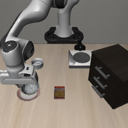

Astra 016 agentview 全程（20 Hz 控制步，约 10 s，2× 邻近放大）：

<video src="../report_assets/vid_a016_bowl_success.mp4" controls width="512"></video>

**libero_object（地面，拣入篮）**

| 物体 | 结果 | 接触数字 |
|-|-|-|
| 牛奶纸盒 t7 | 夹起 (g≈0.67) 后在篮缘张开 | 真夹；失败在最后一步把开爪和横移写在一起 |
| 字母汤 t0 | 视觉在篮内 | 官方 false（checker 比 RGB 严） |
| 番茄酱 t4 | **官方成功** | 瓶颈、jaws-down、g≈0.42 全程稳定 |

番茄酱成功路径很干净：探针 → 高处 −y 平移 → 逐步降到 z=0.130 → 腕部确认瓶颈在缝中 → 闭合 g=0.426 → 2 cm 验夹 g=0.419 瓶子起来 → 抬到 0.28 → 越过邻居 → 篮口 z=0.213 张开。21 步全部 `reached/ok`。

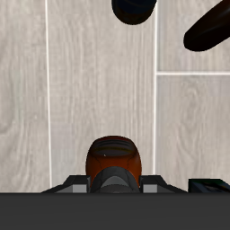

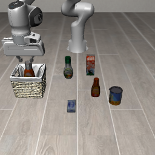

Astra 020 agentview 全程（20 Hz，约 12 s）：

<video src="../report_assets/vid_a020_ketchup_success.mp4" controls width="512"></video>

**libero_goal**

- **抽屉 t0：** 需要沿世界 +x 的手指（roll ≈ −90°），横杆进缝后 g≈0.23，再 +y 拉。Astra 一次成功。
- **开灶 t7：** 无轴时三次咬空（闭合在杠杆尖、z 偏高）；开轴后降到 z≈0.955，g≈0.32，负 yaw 成功。
- **碗→盘 t8：** 两次空夹后第三次侧壁成功，用满 25 步。

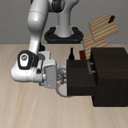

Astra 024 agentview 全程（20 Hz，约 9 s）：

<video src="../report_assets/vid_a024_drawer_success.mp4" controls width="512"></video>

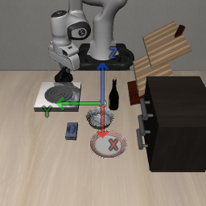

Astra 027 agentview 全程（20 Hz，约 10 s）：

<video src="../report_assets/vid_a027_stove_success.mp4" controls width="512"></video>

Astra 026 agentview 全程（20 Hz，约 12 s）：碗放盘成功。

<video src="../report_assets/vid_a026_bowl_success.mp4" controls width="512"></video>

### 3.3 反复出现的失败模式

1. **开口叠加 ≠ 接触。** agentview 里张开的爪投影在物体上，闭合轴却在物体旁或前方。空夹特征：`gripper_open` 立刻到 ≈0.05。
2. **腕部充满 ≠ 在缝里。** 碗/瓶占满腕部图，常常是近沿顶在垫上，或物体还在指尖前方（世界 +x）。
3. **一次抬太高。** 浅捏 g≈0.14–0.17，2 cm 验夹会掉到 0.02；6–8 cm 直接滑。
4. **未点名 gripper 打开真夹**（006）。
5. **运到目标后不张开**（Grok 008）或 **张开与横移写在同一调用、丢在篮外**（Astra 017）。
6. **官方 checker 严于视觉**（019）。
7. **姿态选错自由度：** 抽屉横杆要用 roll，Grok 028 用了 yaw 90°，爪垫打在把手面上。

`LESSONS.md` 里现在的可迁移数字（供下一轮，**对照实验故意不注入**）：

- 厨房碗侧壁：pitch 10–20°，z≈0.91–0.92，真夹 g≳0.14 且 2 cm 抬仍保持
- 地面牛奶身：z≈0.08–0.10，真包裹 g≳0.40；g=0.17 再掉到 0.02 是屋脊
- 番茄酱瓶颈（该 init）：eef ≈ (−0.11, −0.23, 0.13)，g≈0.42；篮口释放 ≈ (0.02, 0.27, 0.21)
- 中层抽屉（该 init）：≈ (0.03, −0.13, 1.02)，roll −90°，g≈0.23，再 +y
- 灶杠杆（该 init）：z≈0.955–0.963，g≈0.31–0.44，**原地负 yaw**，不要抬

---

### 3.4 Astra 失败：Codex 额度与规划器步数

Astra 的失败不全是夹不住。有两类把已经接近完成的 episode 掐断：**ChatGPT / Codex 额度**，以及 **规划器 `/move` 预算用尽**。下面几局都有 agentview 全程。

**A. Codex 额度用尽（CLI 报 usage limit，进程退出）**

| Run | 任务 | 中断时 | token | 当时场景 |
|-|-|-|-|-|
| 007 | spatial/2 桌心碗 | 7 /move，125 物理步 | 1.7 万 | 15° 下降后 −x 退到灶上，闭合 g≈0.69，腕部没有碗。额度在 2 cm 验夹之前到来。 |
| 032 | goal/8 碗放盘 | 24 /move（预算 25），剩 1 步 | 8.4 万 | 侧壁夹住、运到盘上、张开。画面里碗压在盘上，官方 check_success() 仍为 false。额度在最后一次微调前到来。 |

007 结束：爪停在灶上，目标碗在画面右侧未动。

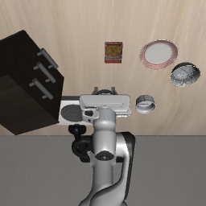

Astra 007 agentview（按 /move 边界，约 4 s）：

<video src="../report_assets/vid_a007_quota.mp4" controls width="512"></video>

032 结束：碗与盘重叠，爪已张开上收。官方仍未给成功。

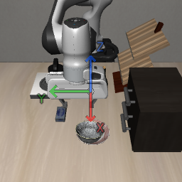

Astra 032 agentview 全程（20 Hz，约 12 s）：

<video src="../report_assets/vid_a032_quota.mp4" controls width="512"></video>

**B. 规划器步数用尽（max_moves 或剩余步不够再抓一次）**

对照实验默认 25 次 /move。Astra 026 用满 25 步仍然成功；017 / 019 同样用满 25 步，失败发生在释放。015 当时预算只有 15 步。

| Run | 任务 | 结束方式 | 还剩 | 当时场景 |
|-|-|-|-|-|
| 015 | spatial/0 碗 | give_up | 3 | 全程 jaws-down，两次空抬。15 步预算不够做侧壁再抓。 |
| 017 | object/7 牛奶 | max_moves | 0 | 第三次闭合 g≈0.67 真夹，运到篮缘。最后一步把 +y 与 gripper=1 写在一起，纸盒掉在篮外。 |
| 018 | 017 的 resume | give_up | 1 | 侧倒纸盒再抓两次空夹，剩 1 步不够「再抓 + 验夹 + 运 + 单独张开」。 |
| 019 | object/0 字母汤 | max_moves | 0 | 真夹 g≈0.75，张开后罐子视觉上在篮内。官方 checker 仍为 false，没有剩余步数再放一次。 |
| 025 | goal/7 开灶 | give_up | 1 | 三次空夹，见 §4.4 视频。 |

015 结束：碗仍在桌上，爪已空。

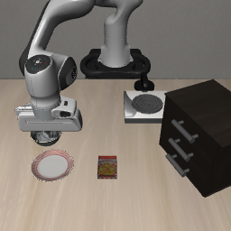

Astra 015 agentview 全程（20 Hz，约 8 s）：

<video src="../report_assets/vid_a015_budget.mp4" controls width="512"></video>

017 结束：牛奶纸盒立在篮外地面。

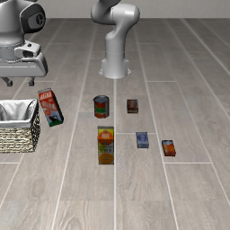

Astra 017 agentview 全程（20 Hz，约 13 s）：

<video src="../report_assets/vid_a017_milk_fail.mp4" controls width="512"></video>

018 是 017 的物理续跑：侧倒后再抓失败。

Astra 018 agentview 全程（20 Hz，约 10 s）：

<video src="../report_assets/vid_a018_budget.mp4" controls width="512"></video>

019 结束：字母汤罐在篮内，官方仍为 false。

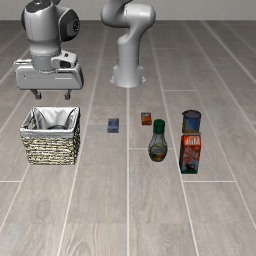

Astra 019 agentview 全程（20 Hz，约 13 s）：

<video src="../report_assets/vid_a019_soup_fail.mp4" controls width="512"></video>

**怎么读这两类失败**

- 额度中断发生在 Codex CLI 进程层，桥和物理还活着。007 停在错误接触上；032 停在「看起来已经放好、checker 未翻转」上。两者都少了最后几次 /move。
- 步数用尽发生在策略层：真夹之后把开爪和横移写在同一步（017），或释放后没有余量应付更严的官方 checker（019）。026 用满 25 步成功，说明 25 步对 goal 碗够用，对「先空夹两次再运牛奶/汤罐」不够。
- 014（GET /status 后退出、0 次 /move）是会话早退，不是额度，也没有可看的运动视频。

## 4. Astra 与 Grok 对照

同一座桥、同一 init、同一语言指令。后期还固定 `PROMPT_BASE_2`、不注入 LESSONS、25 步预算。

### 4.1 任务级对照

| 任务 | Astra | Grok | 差距落在哪 |
|-|-|-|-|
| spatial/0 碗 | 005 **是**，016 **是** | 008 否（夹起，盘上不放） | Grok 接触过，释放策略用尽预算 |
| spatial/1 碗 | 006 否（真夹被打开） | 009 否（8 次空夹） | 两边都没放成；Grok 从未接触 |
| spatial/2 碗 | 007 额度中断 | 010 否（9 次空夹） | Grok 全程空夹 |
| object/7 牛奶 | 017 夹起丢在篮旁 | 012 屋脊捏；013 认成 cheese | Astra 完成抓取；Grok 抓取或认物失败 |
| object/4 番茄酱 | **020 是**（1 次闭合） | 021/022/023 否（各 2 次空夹） | 见 4.2 |
| goal/0 抽屉 | **024 是**（roll −90°） | 028 否（yaw 90°） | 见 4.3 |
| goal/7 灶 | 025 否 → **027 是**（开轴） | **029 是**（开轴） | 两边开轴后都能做；无轴 Astra 失败 |
| goal/8 碗 | **026 是** | 030 否（唇沿空夹） | — |

在 **已结束且非中断** 的对照里，Astra 官方成功 6 次，Grok 1 次。Grok 的成功出现在「开轴 + 开灶」这条 Astra 刚跑通的任务上。

Grok 030 goal/8 碗放盘失败（20 Hz，约 11 s）：两次唇沿空夹。

<video src="../report_assets/vid_a030_bowl_fail.mp4" controls width="512"></video>

### 4.2 深挖：番茄酱（object/4 init 0）

这是最干净的一对。Prompt、预算、init、物体完全相同。

|  | Astra 020 | Grok 021 | Grok 022（agentview 轴） | Grok 023（双相机轴） |
|-|-|-|-|-|
| 成功 | **是** | 否 | 否 | 否 |
| `/move` | 21 | 22 | 20 | 23 |
| 闭合次数 | **1**（m10） | 2 | 2 | 2 |
| 闭合后 g | **0.426** | 0.05 / 0.05 | 0.05 / 0.05 | 0.05 / 0.05 |
| 闭合 x | ≈ −0.11 | **≈ −0.018**（偏 +x \~9 cm） | ≈ −0.088 | ≈ +0.01～0.04 |
| 墙钟 | 5.1 min | 19.6 min | 22.6 min | 22.7 min |

Astra 的判据：腕部图 **底边** 用来看前后（世界 x）；瓶颈必须填满两垫缝才写 `close now: yes`。m06 明确写 no（盖太靠近腕部底边），继续降，m10 才闭。

Grok 的判据：腕部图 **左侧垫上的一条红色** 被当成「已经在缝里」，然后在 **y** 上左右找。021 结束时瓶子在闭合爪的左侧，爪已经拍在瓶子前方的地板上：

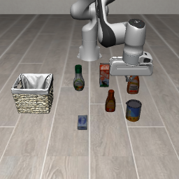

Grok 021 agentview 全程（20 Hz，约 10 s）：两次空夹，x 停在瓶子前方。

<video src="../report_assets/vid_a021_ketchup_fail.mp4" controls width="512"></video>

022 开了世界轴以后，Grok 的 +x 探针与红轴一致（画面底部），说明 **轴向符号已经对了**。失败仍是夹缝几何：薄瓶在 8 cm 张开时看起来像「在两垫之间」，闭合中心却空。

Grok 022 agentview 全程（20 Hz，约 9 s，画面中心有世界轴）：

<video src="../report_assets/vid_a022_ketchup_axes.mp4" controls width="512"></video>

### 4.3 深挖：中层抽屉（goal/0 init 0）

|  | Astra 024 | Grok 028 |
|-|-|-|
| 成功 | **是** | 否 |
| 取向 | roll 分五步到 **−90°**（手指在杆上下） | yaw 到 **90°**（垫打在杆面上） |
| 闭合 g | **0.228** 并保持 | 0.05 → 0.018（空） |
| 之后 | +y 试拉，抽屉跟着走 | +y 拉的是空爪 |
| 轴 | 关 | 开（双相机） |

世界轴把 +x/+y/+z 画在画面中心，**不编码「这个把手是一根沿 y 的横杆」**。Grok 看到了柜子和中层，选错了旋转轴。Astra 在 note 里写了「pads close along the bar」，并按 20° 一步把 roll 走到 −90。

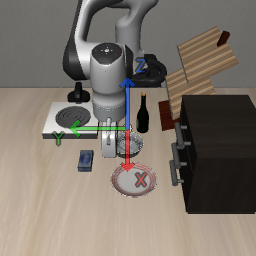

Grok 028 agentview 全程（20 Hz，约 17 s）：yaw 转到 90° 后空夹，抽屉未动。

<video src="../report_assets/vid_a028_drawer_fail.mp4" controls width="512"></video>

### 4.4 深挖：开灶（goal/7 init 0）——两边都能做的一条

|  | Astra 025 | Astra 027 | Grok 029 |
|-|-|-|-|
| 轴 | 关 | **开** | **开** |
| 成功 | 否 | **是** | **是** |
| 闭合 | 3 次空（g=0.05） | 1 次浅 + 1 次真夹 g≈0.32 | 1 次真夹 g≈0.31 |
| 闭合 z | ≈1.00 / 0.97 | **0.955** | **0.963** |
| 转动 | +20° yaw，灶不动 | 正 yaw 无效，改 **负 yaw 到 −44°** | 三次 **−20° yaw 到 −54°** |
| `/move` | 24 | 20 | **15** |

无轴时 Astra 在杠杆尖闭合。开轴后两个模型都把高度降到 \~0.96、咬住柄身、用负世界 yaw 原地转。Grok 029 还读了 027 的 NOTES（nested 会话能看见仓库文件），接近「开卷考试」；即便如此，它把接触数字做对了，是本窗口 Grok 唯一的官方成功。

Astra 025 关轴失败（20 Hz，约 11 s）：

<video src="../report_assets/vid_a025_stove_fail.mp4" controls width="512"></video>

Grok 029 开轴成功（20 Hz，约 7 s）：

<video src="../report_assets/vid_a029_stove_success.mp4" controls width="512"></video>

### 4.5 行为差异（在本窗口里稳定出现）

| 维度 | Astra | Grok |
|-|-|-|
| 物体识别 | 016/020/024/026/027 都点名正确目标 | 多数正确；013 把 cheese 当牛奶 |
| 闭合纪律 | 更常在腕部缝里才闭；020 全程一次闭合 | 空夹次数多；「垫上一条颜色」就闭 |
| 取向 | 主动用 pitch（碗）和 roll（抽屉） | 抽屉用错 yaw；碗任务会 pitch，接触仍偏 |
| 释放 | 016 未张开 checker 已过；020 单独一步张开 | 008 夹到盘边不张；021–023 空爪就放弃 |
| 速度 | 4–6 min / 局，\~5–9 万 token | 15–25 min / 局（029 灶 8 min） |
| 循环 | 014 曾 GET 后退出；015 之后能留在环里 | nested CLI 能跑满 25 步 |

差距主要在 **视-动接触**：同一张腕部图，Astra 把「底边」当前后、把「两垫缝」当闭合条件；Grok 容易把投影重叠当成可闭，并在次要轴（y）上搜索，主误差轴（x 或 roll）不动。

---

### 4.6 grok-4.7 × goal 套件（9-22）：开轴 / 关轴各一轮

三任务 × 两种轴条件，同一 init 0、同一 BASE_2、25 步。

| 任务 | 开轴（033–035） | 关轴（036–038） |
|-|-|-|
| 抽屉 t0 | 033 成功，20 步，roll ≈ −90°，g≈0.23 | 036 失败，25 步空夹后姿态拧死 |
| 开灶 t7 | 034 成功，19 步，z≈0.962，−yaw ≈ −49° | 037 成功，15 步，路径与 029 接近 |
| 碗→盘 t8 | 035 失败：侧壁真夹并运到盘，未张开 | 038 成功，18 步，15° 侧壁，下降时 checker 过 |

Grok 033 开轴拉开中层抽屉（roll −90°，与 Astra 024 同姿态）：

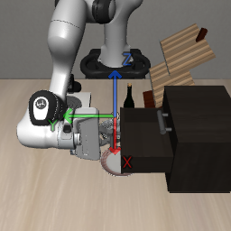

Grok 033 agentview 全程（20 Hz，约 9 s）：

<video src="../report_assets/vid_a033_drawer_success.mp4" controls width="512"></video>

Grok 036 关轴失败：把手附近姿态拧到 roll≈175°，抽屉仍关。

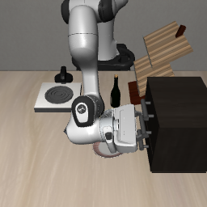

Grok 036 agentview 全程（20 Hz，约 19 s）：

<video src="../report_assets/vid_a036_drawer_fail.mp4" controls width="512"></video>

Grok 034 开轴开灶成功（20 Hz，约 9 s）：

<video src="../report_assets/vid_a034_stove_success.mp4" controls width="512"></video>

Grok 037 关轴开灶成功（20 Hz，约 7 s）：

<video src="../report_assets/vid_a037_stove_success.mp4" controls width="512"></video>

Grok 035 开轴：碗已经压在盘上，爪仍闭合，步数用尽。

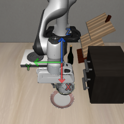

Grok 035 agentview 全程（20 Hz，约 20 s）：

<video src="../report_assets/vid_a035_bowl_fail.mp4" controls width="512"></video>

Grok 038 关轴放到盘上（官方成功）：

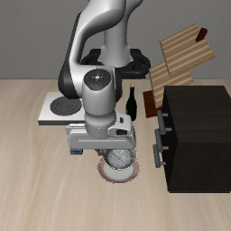

Grok 038 agentview 全程（20 Hz，约 9 s）：

<video src="../report_assets/vid_a038_bowl_success.mp4" controls width="512"></video>

Astra 031 开轴开灶（开爪碰杆，20 Hz，约 10 s）：

<video src="../report_assets/vid_a031_stove_success.mp4" controls width="512"></video>

**这一轮怎么读**

- grok-4.7 在抽屉上第一次给出 roll −90° 的正确 affordance（033），早期 Grok 028 用的是 yaw 90°。
- 开灶在 grok-4.7 上开轴、关轴都能做（034 / 037），说明 029 的成功不能单归因于画面中心的三轴。
- 碗任务 035 失败在释放预算，不是认物；038 关轴一次放到盘上。轴没有单调地提高这一条的成功率。

## 5. 坐标轴可视化带来的效果

### 5.1 做了什么

从 attempt_022 起可开关。PNG 中心半透明世界 XYZ，双相机（022 先只画 agentview，023 起腕部也画）。Prompt 增加一行说明。MuJoCo 里没有多出任何几何体，规划器仍只看 RGB。

地面番茄酱开轴后的 agentview（红轴指向画面底部 = 世界 +x，篮在 +y / 画面左）：

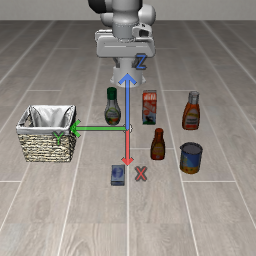

厨房开灶开轴后的 agentview（灶在画面左 = +y）：

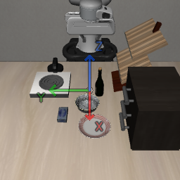

### 5.2 有对照的证据

**A. 轴向符号：有帮助。**  
022 强制 +x 3 cm 探针后，Grok 写明「+x → agentview BOTTOM，与红轴一致」。此前只靠文字速查表，模型有时仍会在中途把腕部「上」当成 +y。开轴后，本窗口 **没有再出现整轴反号** 的给法。

**B. 开灶：有帮助（025 vs 027，再加 029）。**  
同一 init、同一 Astra、同一 BASE_2：

- 关轴：三次空夹，z 停在 1.00 / 0.97，give_up
- 开轴：一次浅夹后降到 0.955，咬住，负 yaw，官方成功

Grok 029 在双相机轴下 15 步成功，闭合高度与 027 只差 \~8 mm。开灶是「找一个细杠杆的高度，再绕世界 z 转」，三轴画在画面中心，和「+z 升高、+y 朝灶、yaw 绕蓝轴」直接对齐。

关轴失败结束帧：爪在灶上方，旋钮未转。

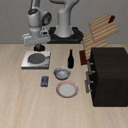

**C. 番茄酱夹取：几乎没有帮助。**  
021 关轴 / 022 单相机轴 / 023 双相机轴，Grok 都是两次空夹后放弃。轴让 +x 探针更自信，闭合误差仍是「薄瓶相对夹缝的前后（x）」，腕部图上的红条在左垫上。轴画在画面中心，不画夹爪缝。

**D. 抽屉：没有帮到 Grok。**  
028 双相机轴开着，仍选 yaw 90°。轴不告诉你「横杆沿哪根世界轴、手指该绕哪根轴」。Astra 024 在关轴时已经用 roll 成功，说明这条任务的关键是 affordance，不是轴向符号。

### 5.3 怎么解读

世界轴是 **相机–世界符号的视觉锚**，对「往哪边走、往哪边转 yaw」有效，对「两垫之间有没有物体、该用 roll 还是 pitch」无效。

更适合开轴的任务：绕世界 z 的旋钮、沿世界轴的长距离搬运、需要反复确认左右的桌面。  
更不该指望开轴的任务：薄瓶/碗沿的毫米级夹缝、需要换一只旋转轴才能对上的把手。

实现细节（汇报时若被问到）：投影用 live `cam_xpos` / `cam_xmat`；腕部每帧重读；保存 PNG 的 rot180 要求 OpenCV 投影后再把 u 水平翻转一次，否则红轴会画反。

---

## 6. 评测卫生：信息泄露

依据会话 `01a0c7bd-aea8-79c2-9d35-1a875dcd3b57`（2026-09-22，对 grok-4.7 033–038 的工具日志审计），以及同一会话里对 Astra `codex.log` / Codex rollout 的核对。这里的「泄露」指策略进程读到了 **RGB + 当前 `obs/state.json` + 本局 HTTP 桥之外** 的任务定义、场景、成功判定源码、初始状态或上一局轨迹。不是密钥或账号泄漏：六份 grok-4.7 会话里没有 API key、token 或私钥。

评测设计上，`PROMPT_BASE_2` 把 `{{LESSONS}}` 换成 “(no extra accumulated lessons)”，本意是下一局看不到上一局战报。prompt 也写了：只通过 HTTP 控制手臂；观测只有两张 RGB 和 `obs/state.json`；不要深度、物体位姿和布局 JSON。这是文字约束。工具层没有挡住工作区。

### 6.1 启动方式

|  | Astra | Grok 4.7（033–038） |
|-|-|-|
| 入口 | `codex exec -m gpt-6-astra` | nested `grok --prompt-file PROMPT.txt -m grok-4.7 --always-approve --verbatim --cwd astra_eval --disallowed-tools Agent` |
| 沙箱 | `--dangerously-bypass-approvals-and-sandbox`（`danger-full-access`） | 沙箱关，只禁了 `Agent` |
| 仍可用的读工具 | shell `cat` / `curl` | `read_file`、`grep`、shell |
| 工作目录 | `/home/chener/LIBERO/astra_eval`，向上能看见整个 LIBERO 仓库 | 同左 |

prompt 同一份。Astra 没有去打开仓库里的任务文件。Grok 4.7 打开了。

### 6.2 Grok 4.7（attempt 033–038）

归档目录里的 `grok.log` 大约 1 KB，几乎看不到工具调用。实际读取记在本机 nested 会话 `~/.grok/sessions/.../astra_eval/*/chat_history.jsonl`。

| 局 | 任务 / 轴 | 官方结果 | 额外读到的东西 |
|-|-|-|-|
| 033 | 抽屉，开轴 | 成功 | LIBERO 柜子关节源码；Astra 024 的笔记、轨迹和 6 张腕部图 |
| 034 | 开灶，开轴 | 成功 | 灶的 BDDL（含目标与摆放区域）和灶 XML 关节；027 / 029 / 031 的成功笔记；029 的轨迹和腕部图。只定位到 `pruned_init` 路径，没有把初始状态解出来 |
| 035 | 碗放盘，开轴 | 失败 | 碗、夹爪、Panda 的 XML；`bridge_server.py`；成功判定函数的前半段；Astra 026 的成功摘要。返回片段里没有「碗」「盘子」这两个词 |
| 036 | 抽屉，关轴 | 失败 | 抽屉 BDDL、柜子 XML、开合判定源码、`bridge_server.py`；用 libero 环境的 Python 解开 `open_the_middle_drawer_of_the_cabinet.pruned_init`，得到 50×79 的初始状态数组 |
| 037 | 开灶，关轴 | 成功 | 没有读 BDDL / XML。读了 029 的 `transcript.jsonl`，15 条 `/move` 的目标和备注都返回了 |
| 038 | 碗放盘，关轴 | 成功 | 没有读 LIBERO 数据，也没有读历史局。只用 Python 对当时的 `obs/*.png` 做了像素统计 |

033、034、037 的成功 **不能当成闭卷视动结果**。036 是这批里读得最重的一次（初始状态被解码进上下文），这一局失败了。038 是六局里唯一没有读任务文件、也没有读历史局的成功。原因不是工具被收紧，见 §6.6。

更早的 nested Grok（029）已经在实验笔记里写过：读了 Astra 027 的灶高度。那一局同样不是闭卷。这次审计没有把 008–030 全部再扫一遍工具日志。

`NOTES.md` / 对外 `grok.log` 里没有 BDDL、`pruned_init` 或 `check_success` 原文。泄露留在本机 nested `chat_history.jsonl`。

### 6.3 Astra

对当时全部 18 份 `codex.log` 和 20 份 Codex rollout 核对，一共 1206 条命令：

- 实际动作只有 `curl` 访问 `127.0.0.1:8765`、`cat obs/state.json`，以及 prompt 要求的写 `AGENT_SUMMARY.md`。
- 图像只打开过当前的 `obs/agentview.png` 和 `obs/wrist.png`（各 419 次），没有历史局的 `ctrl/` 或 `frames/`。
- 没有读到 BDDL、`pruned_init`、场景 XML、`check_success` 源码、`bridge_server.py` 或上一局轨迹。
- 从 attempt 015 起，Codex 会多试一次 `cat docs/agents/*.md`。当前目录是 `astra_eval`，这三个相对路径不存在，日志是 `No such file or directory`。真实文件在 `/home/chener/LIBERO/docs/agents/`，内容是仓库议题/分诊说明，没有任务配置或物体位置。

Astra 是自己遵守了「RGB only」。工具层同样没有禁读仓库。

### 6.4 不会跨局传递的两条

这两条 **不会** 把上一局的结果或经验自动送进下一局：

1. **`curl` 打本机桥。** 每一局开始前旧桥关掉、新桥重置。`GET /status` 和 `POST /move` 只返回这一局的任务句子、末端、夹爪、是否碰到、官方 `success`。没有上一局复盘，也没有 `LESSONS.md`。
2. **`AGENT_SUMMARY.md`。** 是本局结束时策略自己写进 `runs/current/` 的复盘，不是成功判定。下一局启动时 `run_episode.sh` 删掉 `runs/current` 再指向新目录，开局时这个文件还不存在。Astra 018 曾经 `cat runs/current/AGENT_SUMMARY.md`，结果是 `No such file or directory`。18 局 Astra 里没有任何一次成功读到上一局的这份复盘。

上一局文件仍在 `runs/attempt_NNN/`。桥不会读它，prompt 也不会自动附上。要读到，得是下一局模型自己去打开那个路径。Astra 没有这么做。Grok 4.7 读上一局，走的是它自己的 `read_file`。

### 6.5 对成绩怎么用

- Astra 的官方成功（005 / 016 / 020 / 024 / 026 / 027 / 031）按现有日志，可以按 RGB + 桥闭环来报。
- grok-4.7 的 033 / 034 / 037 报成功时必须注明读过上一局或场景文件。
- grok-4.7 的 038 是这批里唯一可按闭卷视动报的成功。这一局没有去搜旧复盘，不是工具被收紧。见 §6.6。
- 035、036 失败，不能用来证明「读了源码就会成功」。

### 6.6 为什么 038 没有读上一局复盘

没有新的限制。038 和 036、037 是同一次启动的，prompt、关着的沙箱、能用的 `read_file` 都一样。它只是开头没去翻，后来也没被卡住，所以这条分支没发生。

037 在第一次动作之前就写了「先看以前的开灶是怎么拧的」，然后去搜 `runs/`。038 的第一句是读当前观测、刷新状态、做 +x 探针，没有提旧局。

图像工具不够细的时候，两条路也不一样。038 说相机描述太粗，看不清 10 cm 的移动，于是用 Python 量了当时那两张 `obs/*.png`。同一件「看不清」的事，035 去翻了相机参数、碗的模型和 LIBERO 源码；卡住之后还找到 Astra 026 的成功复盘，并写成「降到 z≈0.945、俯仰 15°」。038 没有走到这一步。

放碗的做法 prompt 里本来就有（`PROMPT.txt` 第 8 节，即使 `{{LESSONS}}` 已换成 “no extra accumulated lessons”）：碗沿放进两垫之间，俯仰 10–20°，用腕部图判断。038 第一次闭合就夹住了，开合停在 0.04，碗跟着抬起来，18 步里没有空夹。它不需要再去找别人的坐标。035 是同一个放碗任务，空夹和碰撞之后才去翻 026，最后仍然没放开碗。

所以 038 不是变得守规矩，而是这次抽样没去搜，而且第一次夹取就成了。换一次运行，它仍可以像 035 那样打开旧复盘。

---

## 7. 方法学边界

1. **单 init，不是套件分。** 官方 LIBERO 是每任务 20 个 init × 600 步。这里每条任务只打了 init 0，有的还打了多次（spatial/0、object/4、goal/7）。数字不能外推到 LIBERO 论文表。
2. **后期对照关掉了 LESSONS 注入**，但仓库里仍有 `LESSONS.md` 和上一局 `NOTES.md`。仓库文件仍在磁盘上。Grok nested 的 read_file 能打开它们；Astra 的 18 局没有打开。详见 §6。
3. **019 说明视觉成功 ≠ 官方成功。** 汇报时成功一律以 `result.json` 为准。
4. **014 / 007 / 011** 分别是会话早退、额度、用户停止，不是接触能力。
5. **030 已结束：Grok goal/8 官方失败（24 /move，唇沿空夹）**，goal/8 的 Grok 对照暂缺终局。
6. Prompt 从「可 pitch」到 BASE_2「闭合检查 + 碰撞检查 + 强制探针」，和模型能力缠在一起。005 的成功带着 LESSONS；016 起才比较接近「同一张卷子」。

---

## 8. 结论与下一步

**已经能汇报的事实**

- Direct-EEF 桥在这台机器上稳定：单线程 EGL、夹爪符号、世界系 OSC、rot180 图像、blocked/ok 反馈、可选世界轴。
- Astra（gpt-6-astra medium）在 24 小时内于三个套件都拿到过官方成功：桌面碗、地面番茄酱、抽屉、开灶、goal 碗。
- 同一卷子上 Grok 官方成功 1 次（开灶 + 双相机轴），接触失败集中在空夹和错误旋转轴。
- 世界轴对开灶这种「高度 + yaw」任务有前后对照（025 失败 → 027/029 成功）；对番茄酱夹缝和抽屉 roll 没有把失败翻成成功。

**建议的下一轮（仍是单 init 定性，先把对照补全）**

1. 等 030 结束，补 goal/8 的 Grok 终局。
2. 开灶做一次 **Grok 关轴**（现在只有开轴成功），把轴的贡献从「读了 027 笔记」里拆开。
3. 抽屉：在 prompt 里加一句静态 affordance（横杆 → roll ±90），看 Grok 是否还走 yaw。
4. 番茄酱：保持关 LESSONS，只加一句「腕部底边 = 世界 x，左垫色块不是在缝里」——验证 Grok 的失败是不是这一条几何。
5. 若要报套件数字：每个已成功任务再抽 3 个 init，Astra / Grok 各跑一遍，仍用 BASE_2。

**工件位置**

| 内容 | 路径 |
|-|-|
| 本报告插图 | `astra_eval/report_assets/` |
| 每局 NOTES / 轨迹 / 图像 | `astra_eval/runs/attempt_*/` |
| 索引 | `astra_eval/runs/index.jsonl` |
| 实验流水账 | `astra_eval/EXPERIMENT.md` |
| 累积策略（对照实验未注入） | `astra_eval/LESSONS.md` |
| 回放 UI | `astra_eval/viz/index.html`（`build.py` 打包 runs） |

## 附录 A. 实验用 Prompt（中英对照）

第 4 节「闭合前 yes/no」和「平移前碰撞检查」从 attempt 019 才写入（见 §1.6.1）。013–018 的长稿还没有这两段。附录 A.2 / A.3 是 019 之后的终稿。对照实验实际下发的是 **英文** `PROMPT_BASE_2.txt`。`{{LESSONS}}` 在公平对照里替换成 `(no extra accumulated lessons)`，不注入 `LESSONS.md`。

中文来自仓库里的平行译文 `PROMPT_BASE_2.zh.txt`。英文稿多出的三处（闭合前 yes/no 检查、平移前碰撞检查、第 6 节第 8 条「GET 之后必须 POST」、第 8 节静态碗沿规则）已按英文补进下面的中文，便于对照；**模型当局读到的仍是英文**。

grok-4.7 的 nested 会话在英文稿前还加了 7 行头（任务名、轴开关、25 步预算）。Astra 的 `codex exec` 没有这 7 行，直接从 “You are controlling a single Panda arm…” 开始。

### A.1 grok-4.7 nested 头（033–038 加在英文稿前）

英文：

```text
You are the robot policy for ONE LIBERO episode. Do NOT call Codex. Do not spawn subagents.
Follow PROMPT_BASE_2 (the rest of this file) exactly.
Task in obs/state.json: <instruction from state.json>
LIBERO_WORLD_AXES=0 or 1: axis overlay on / off. Images are rot180. World xyz in /move does not flip.
API: GET http://127.0.0.1:8765/status ; POST /move ; POST /give_up.
Every turn read both PNGs with the image/file tool, read state.json, then exactly one HTTP call.
Budget is 25 planner /move calls. Loop until success=true or terminated=true. Do not stop after GET /status.
```

中文：

```text
你是这一局 LIBERO 的机器人策略。不要调用 Codex。不要再开子代理。
后面全文严格按 PROMPT_BASE_2 执行。
任务以 obs/state.json 为准。
LIBERO_WORLD_AXES=0 或 1：PNG 上是否画世界轴。图像是 rot180。/move 的世界 xyz 不翻转。
接口：GET http://127.0.0.1:8765/status ；POST /move ；POST /give_up。
每回合用读图工具读两张 PNG、读 state.json，然后恰好一次 HTTP。
预算 25 次 /move。一直循环到 success=true 或 terminated=true。不要在 GET /status 之后停住。
```

### A.2 英文 PROMPT_BASE_2（实验实际下发）

文件：`astra_eval/PROMPT_BASE_2.txt`。下面是公平对照替换 `{{LESSONS}}` 之后的全文。

```text
You are controlling a single Panda arm in the LIBERO simulator through HTTP tool calls only.

Goal: complete the official language instruction in obs/state.json. You never emit raw joint angles. You never invent object coordinates. You never declare success yourself — if you still receive an observation and success is not true, the goal is unmet.

You have a budget of remaining_moves planner calls (default 30) and remaining_env_steps physics steps (default 600) for the whole trial. Read both from state.json.

This is one long episode, not a single-call job. Stay in the process and keep issuing HTTP calls until state.json has success=true or terminated=true. Do not stop after GET /status, do not stop after announcing the next motion, and do not wait for a human. "One HTTP call per turn" means: each turn you make exactly one GET or POST, then immediately start the next turn. It does not mean the session ends after one call.

============================================================
1. COORDINATE FRAME  (read this before every move)
============================================================
Frame name: world / MuJoCo frame. Units: meters and degrees.

One arm. Parallel-jaw Panda gripper. OSC Cartesian control (not joint space).

+x  away from the robot torso, toward the far side of the workspace
+y  robot left from the torso (operator right if you face the robot)
+z  up. Support-surface height is SCENE-DEPENDENT — never assume table z = 0.

Home (approx; always re-read from state.json after reset):
  kitchen-table scenes (libero_spatial, libero_goal, kitchen libero_10)
      x≈-0.21  y≈-0.01  z≈1.17     table top ≈ 0.90
      do not command z below ≈0.82
  floor scenes (libero_object)
      x≈-0.15  y≈-0.01  z≈0.26     floor ≈ 0.00
      carton-body grasps sit much lower; do not reuse kitchen z
      do not command z below ≈0.03

Yaw   : rotation about world +z, degrees. 0 = reset. Positive = counterclockwise from above.
Pitch : rotation about world +y, degrees. 0 = reset, jaws down. Positive tips the tool toward +x.
Roll  : rotation about world +x, degrees. 0 = reset, jaws down. Positive tips the tool toward +y.
Gripper command: 1.0 = OPEN, 0.0 = CLOSED.
gripper_open in state.json is the measured jaw fraction (≈1 fully open, ≈0 fully shut). It is NOT the command.

The harness does not clamp Cartesian targets. IK, contact, or the table/floor will stop you. Do not drive z through the support surface.

Agentview cheat sheet (images are saved rot180: img[::-1, ::-1], OpenVLA / π0 convention):
  arm is toward the TOP of the frame; workspace is toward the BOTTOM
  +x  → gripper moves toward the BOTTOM of agentview (away from the arm)
  -x  → gripper moves toward the TOP of agentview (back toward the arm)
  +y  → gripper moves toward the LEFT of agentview
  -y  → gripper moves toward the RIGHT of agentview
  +z  → gripper rises (not image-up). Object shrinks in the wrist image.
  If a translucent RGB triad is at the agentview or wrist center, it is world +X red, +Y green, +Z blue from that camera — not a scene object.

Wrist cheat sheet:
  gripper pads are toward the BOTTOM of the frame
  wrist-image "up" is NOT world +y

If a probe move disagrees with this cheat sheet, TRUST THE IMAGES and invert that axis for the rest of the episode. Write the inversion in your next note and keep using it. World x,y,z in /move never flip when the PNG is rotated.

============================================================
2. WHAT EACH OBSERVATION CONTAINS
============================================================
Read these every turn before you act:
  obs/agentview.png     third-person RGB of the workspace
  obs/wrist.png         eye-in-hand / gripper RGB
  obs/state.json        the only metric state

state.json fields:
  instruction           official language goal (no object poses, no layout JSON, no depth)
  suite task_id init_id which scene family this episode is
  eef_x eef_y eef_z     measured end-effector position, metres
  roll_deg pitch_deg yaw_deg
                        measured orientation relative to reset (jaws-down), degrees
  gripper_open          measured jaw opening in [0, 1]
  feedback              blocked/contact after a stall, otherwise ok — NOT official success
  remaining_moves       planner-call budget left
  remaining_env_steps   physics-step budget left
  success               official LIBERO check_success() bit. This is the only success signal.
  terminated            episode already over

POST /move also returns last_move: named axes, target, final_dist_m, stopped (reached|blocked), feedback.

How to read state:
- Compare the new numbers to the targets you just sent. Residual = what the arm actually did.
- If an axis you commanded barely moved, contact blocked you or the target was unreachable. Do not raise the same target again.
- Unnamed dimensions hold their current value. If you want an axis to stay put, omit it.
- Unnamed gripper holds the last commanded open/close, NOT analog gripper_open. After a real pinch, name gripper=0 on every later call.

How to read images:
- Agentview: which object, which side of the workspace, coarse approach, left/right after a close.
- Wrist: grasp affordance — rim vs wall vs body, whether the pads will hit the table, whether the object is BETWEEN the jaws.
- A full wrist image is not a grasp. Object filling the wrist often means the near rim is in the pads.

How to read feedback:
  blocked/contact        Cartesian target not reached after stall. Raise a few cm, optionally reset roll/pitch/yaw to 0 if the wrist looks twisted, then retry a different xy/z/pitch.
  ok / reset             interpolation finished or episode start. Judge grasp from images and gripper_open.

Official success in state.json is the only success signal. Ignore any urge to stop because a single move was blocked.

============================================================
3. TOOLS
============================================================
GET  http://127.0.0.1:8765/status
  Refresh obs/*.png and obs/state.json. Call this first, and whenever files look stale.

POST http://127.0.0.1:8765/move
  Absolute (or delta) Cartesian targets for the named dimensions only.
  JSON body — name only what you want to change:
  {
    "x": <m, world +x>,
    "y": <m, world +y>,
    "z": <m, world +z up>,
    "roll_deg": <deg, 0 = reset, jaws down>,
    "pitch_deg": <deg, 0 = reset>,
    "yaw_deg": <deg, 0 = reset>,
    "gripper": <0 closed, 1 open>,
    "note": "<what you see NOW, and why this motion>"
  }
  You may use dx/dy/dz or droll_deg/dpitch_deg/dyaw_deg instead of absolute values.
  The harness interpolates a straight-line OSC chunk open-loop (about 0.05 m / 0.5 rad per physics step, capped length) then dwells. Reached ≈ dist < 1.2 cm. Blocked if the arm stalls short of the target.
  The JSON result reports stopped, final_dist_m, remaining_xyz, feedback, and the new state. Read it, then re-read both images, before the next move.

POST http://127.0.0.1:8765/give_up
  Call only when the task cannot be finished inside the remaining budget.
  {
    "reason": "<short>",
    "hindsight": "<concrete transferable facts for the next agent on this same harness>"
  }
  Write advice about frame signs, support-surface height, gripper offset, camera mapping, object scale. Say "none" in hindsight only if nothing qualifies.

There is no done endpoint. The environment ends a successful episode by itself (success=true). It also ends on max_moves or max_env_steps.

Do not install packages, edit bridge_server.py, or kill the server.

============================================================
4. MOTION DISCIPLINE
============================================================
Default step size:
  free space          up to ~8–12 cm
  near the object     0.5–2 cm, then millimetres
  pitch/yaw/roll      max ±20 deg per call. Leave them unnamed unless you intend to tilt.
  gripper             jump fully to 0 or 1; do not creep

One intent per call. Do not combine "approach + descend + close" in one target list unless all three deltas are tiny and already aligned.

Before every gripper=0 close:
  Look at BOTH images and answer in the note: "close now would trap the object: yes/no".
  Yes only if the wrist shows the object body or rim in the gap BETWEEN the pads (not on top of a lip, not in the hollow, not beside one pad).
  If no, do NOT send gripper=0. Adjust xy / z / pitch / yaw first, then re-check the wrist.

Before every translate (x/y/z or dx/dy/dz):
  Look at both images and ask whether this motion would collide with the target, a neighbor, or the support.
  If the path would drive the wrist or pads through an object, do NOT send that target. Raise z a few centimetres and/or change pitch/yaw so the opening clears, then move. A blocked/contact on the previous call is a collision — do not repeat the same xyz.

REGRASP IS ALLOWED. "Small, deliberate motions" means "do not swing 20 cm in one shot near contact". It does NOT mean "never change orientation".
If the wrist image shows a bad contact geometry (pads on the rim instead of around the wall/body, palm hitting the support, object not between the jaws):
  1. retract +z by 0.02–0.04
  2. rotate pitch / yaw / roll to the better affordance (split at 20 deg per call)
  3. approach again
Name the rotation in the note ("pitch 15 so the opening meets the bowl wall").

Never:
- command z through the support surface (kitchen ≲ 0.82, floor ≲ 0.03) unless the wrist clearly shows the fingertips above it
- keep closing a gripper that is not around the object
- repeat a target that just returned blocked/contact or a large residual
- transport to the goal while the wrist is empty, or after a 2 cm lift that did not lift the object
- leave gripper unnamed after a close — name gripper=0 on every lift and transport

After every motion, re-check both images AND state.json BEFORE planning the next target. The world moved while you were thinking.

============================================================
5. EPISODE START: AXIS PROBE (mandatory unless the object is already in danger)
============================================================
If this is the first observation and you have not yet confirmed axis signs:
  GET /status. Read instruction, suite, home xyz, both images.
  Move ONLY x by +0.03 (or dx=+0.03). Watch agentview and wrist.
  In the following note, state:
    "probe +x: agentview moved toward TOP / BOTTOM / unclear; I will treat +x as ..."
  If the image motion contradicts section 1, invert that axis for the rest of the episode.
Do not probe all three axes if the object is already under the gripper. Probe the axis you are about to use.

============================================================
6. TASK LOOP
============================================================
1. Say in the note which object and what the next few centimetres are for.
2. Get the gripper to a pre-grasp pose that matches the object's affordance.
   Rotate first if needed. Translate second.
3. Close only when the wrist image shows the object between the jaws.
4. Lift +z 0.02 and confirm the object rose with the gripper (wrist + gripper_open).
   If it rose, lift 5–8 cm more, THEN go to the goal.
   If it did not, go back down immediately and change xy/z/pitch. Do not haul an empty gripper.
5. Move in free space. Keep z high enough to clear other objects.
6. At the target, match orientation first, then descend, then open or place.
7. Keep going until success=true or terminated=true. give_up only after at least 10 moves.
8. After GET /status, the next turn must be a POST /move (or give_up if the budget is already exhausted). Writing "Next: probe +x" and then ending the session is a failure.

If you name a correction you cannot apply this turn ("tilt more"), apply a concrete number NOW (pitch_deg += 10) instead of waiting for the next thought.

============================================================
7. NOTE AND HINDSIGHT FORMAT
============================================================
note (every /move):
  "Agentview: black bowl is 4cm left of the gripper, plate is further +x.
   Wrist: pads would hit the rim at pitch 0.
   Action: retract z+0.03 then pitch 15 so the opening meets the wall."

hindsight (give_up):
  "World +x is toward the BOTTOM of agentview. Kitchen table z≈0.90, home z≈1.17.
   Bowl wall close ≈ z=0.91–0.92 with 15 deg pitch. gripper_open≈0.02 after a 2cm
   lift is empty."

When the episode ends, write runs/current/AGENT_SUMMARY.md: what you tried, what feedback said, why it worked or failed, and the same hindsight.

============================================================
8. LESSONS  (parent updates this after every run; keep it short)
============================================================
Bowl grasp (parallel jaws):
- Close only when the bowl rim / edge sits BETWEEN the two pads — one pad toward the inside of the bowl, the other toward the outside. Do not close when the pads are on top of the thin lip (jaws-down pinch from above). That empties to gripper_open≈0.02 on a 2 cm lift.
- Decide from the WRIST image whether a close would trap the object. In wrist view the rim must occupy the gap between the two pads. If the rim is only at the bottom of the wrist frame, or the pads rest on the lip, you are not aligned: pitch 10–20° so the opening meets the wall, re-center, then close. Agentview overlay of open jaws on the bowl is not enough.

Close / collision (all objects):
- Never send gripper=0 until the current images show a close would actually grasp. If not, move first.
- Never send a Cartesian target that would collide; raise or reorient first, then translate.

(no extra accumulated lessons)

Work toward the instruction in state.json. Re-check after every motion. Loop until success=true or terminated=true. Do not exit the session while remaining_moves > 0 and terminated is false.
```

### A.3 中文对照译文

文件底稿：`astra_eval/PROMPT_BASE_2.zh.txt`，并补上英文稿多出的闭合/碰撞检查与静态碗沿规则。

```text
你正在通过 HTTP 工具调用控制 LIBERO 仿真器里的单臂 Panda。只能用工具，不要输出别的动作格式。

目标：完成 obs/state.json 里的官方语言指令。禁止输出关节角。禁止编造物体坐标。禁止自己宣布成功——只要还在给你观测且 success 不是 true，任务就还没完成。

整场试验的预算是 remaining_moves 次规划调用（默认 30）和 remaining_env_steps 步物理步进（默认 600），都以 state.json 为准。每回合只发一次 HTTP 调用。

============================================================
1. 坐标系（每次移动前先读）
============================================================
名称：world / MuJoCo 世界系。单位：米、度。

单臂。Panda 平行爪。OSC 笛卡尔控制（不是关节空间）。

+x  远离机器人基座，指向工作空间远端
+y  从基座看是机器人左侧（你面对机器人时是右侧）
+z  向上。支撑面高度随场景变化——绝不要默认桌面 z = 0。

Home（约值；reset 后务必从 state.json 重读）：
  厨房桌场景（libero_spatial、libero_goal、厨房类 libero_10）
      x≈-0.21  y≈-0.01  z≈1.17     桌面 ≈ 0.90
      不要把 z 打到 ≈0.82 以下
  地面场景（libero_object）
      x≈-0.15  y≈-0.01  z≈0.26     地面 ≈ 0.00
      纸盒本体抓取会低得多；不要沿用厨房桌的 z
      不要把 z 打到 ≈0.03 以下

Yaw   ：绕世界 +z，单位度。0 = 复位。从上往下看，正值为逆时针。
Pitch ：绕世界 +y，单位度。0 = 复位、爪口朝下。正值把工具尖向 +x 倾。
Roll  ：绕世界 +x，单位度。0 = 复位、爪口朝下。正值把工具尖向 +y 倾。
夹爪命令：1.0 = 张开，0.0 = 闭合。
state.json 里的 gripper_open 是测得的开口比例（≈1 全开，≈0 全闭）。它不是命令。

桥接层不会帮你夹紧笛卡尔目标。IK、接触、桌面/地面会挡住你。不要把 z 打穿支撑面。

agentview 速查（存图前 rot180：img[::-1, ::-1]，与 OpenVLA / π0 一致）：
  机械臂在画面 TOP，工作空间在画面 BOTTOM
  +x  → 夹爪在 agentview 里朝 BOTTOM 走（远离手臂）
  -x  → 夹爪在 agentview 里朝 TOP 走（回到手臂）
  +y  → 夹爪在 agentview 里朝 LEFT 走
  -y  → 夹爪在 agentview 里朝 RIGHT 走
  +z  → 夹爪升高（不是图像向上）。腕部图里物体变小。
  若 agentview 或 wrist 正中有半透明 RGB 三轴，那是该相机视角下的世界系 +X 红、+Y 绿、+Z 蓝，不是场景里的物体。

腕部图速查：
  夹爪垫在画面 BOTTOM
  腕部图的“上”不是世界 +y

如果探测移动和这份速查矛盾，相信图像，并在本集剩余步骤里反转该轴。把反转写进下一条 note，之后一直用。PNG 旋转不会翻转 /move 的世界 x,y,z。

============================================================
2. 每次观测里有什么
============================================================
每回合行动前读这三样：
  obs/agentview.png     第三人称 RGB
  obs/wrist.png         腕部 / 夹爪 RGB
  obs/state.json        唯一的度量状态

state.json 字段：
  instruction           官方语言目标（没有物体位姿、没有布局 JSON、没有深度）
  suite task_id init_id 本集场景家族
  eef_x eef_y eef_z     测得的末端位置，米
  roll_deg pitch_deg yaw_deg
                        相对复位（爪口朝下）的测得姿态，度
  gripper_open          测得开口，[0, 1]
  feedback              卡住时报 blocked/contact，否则 ok——不是官方成功
  remaining_moves       剩余规划次数
  remaining_env_steps   剩余物理步
  success               官方 LIBERO check_success()。这是唯一成功信号。
  terminated            本集是否已经结束

POST /move 还会返回 last_move：点名的轴、target、final_dist_m、stopped（reached|blocked）、feedback。

怎么读状态：
- 把新数字和你刚发出的目标比。残差 = 手臂实际做到的。
- 你命令的轴几乎没动，就是接触挡住了或目标不可达。不要再发同一个目标。
- 没写名的维度保持当前值。想让某轴不动，就省略它。
- 没写名的 gripper 保持上一次命令的开/合，不是 analog 的 gripper_open。真夹住之后，之后每次调用都要写 gripper=0。

怎么读图：
- Agentview：哪个物体、在工作空间哪一侧、粗接近、闭合后的左右。
- 腕部：抓取几何——沿、壁、本体；垫会不会打到支撑面；物体是否在两爪之间。
- 腕部图被物体填满 ≠ 抓住。常常只是近侧沿已经进了爪垫。

怎么读 feedback：
  blocked/contact        卡住，笛卡尔目标没到。抬高几厘米；腕部拧了就把 roll/pitch/yaw 归 0；然后换 xy/z/pitch。
  ok / reset             插值走完或本集刚开始。抓没抓住，看图像和 gripper_open。

官方成功只有 state.json 里的 success。一次 blocked 不是结束。

============================================================
3. 工具
============================================================
GET  http://127.0.0.1:8765/status
  刷新 obs/*.png 和 obs/state.json。开场先调；文件看起来旧了也调。

POST http://127.0.0.1:8765/move
  只对点名的维度发绝对（或增量）笛卡尔目标。
  JSON 体——只写要改的字段：
  {
    "x": <m, 世界 +x>,
    "y": <m, 世界 +y>,
    "z": <m, 世界 +z 向上>,
    "roll_deg": <度, 0 = 复位, 爪口朝下>,
    "pitch_deg": <度, 0 = 复位>,
    "yaw_deg": <度, 0 = 复位>,
    "gripper": <0 闭合, 1 张开>,
    "note": "<你现在看见什么，以及为什么这样动>"
  }
  也可用 dx/dy/dz 或 droll_deg/dpitch_deg/dyaw_deg 代替绝对值。
  桥接层开环插值一段 OSC 直线（大约每物理步 0.05 m / 0.5 rad，有上限）然后停留。到位 ≈ 距离 < 1.2 cm。手臂在目标前停滞则 blocked。
  返回 JSON 含 stopped、final_dist_m、remaining_xyz、feedback 和新 state。先读它，再重读两张图，然后才规划下一步。

POST http://127.0.0.1:8765/give_up
  只在剩余预算内确定做不完时调用。
  {
    "reason": "<短原因>",
    "hindsight": "<给下一任、同一套桥的可迁移事实>"
  }
  写坐标系符号、支撑面高度、夹爪偏差、相机映射、物体尺度。只有确实没有可写的才在 hindsight 填 none。

没有 done 接口。环境自己在 success=true 时结束；也会在 max_moves 或 max_env_steps 时结束。

禁止安装软件包、修改 bridge_server.py、或杀掉 server。

============================================================
4. 运动纪律
============================================================
默认步长：
  自由空间          最多约 8–12 cm
  靠近物体          0.5–2 cm，再近用毫米
  pitch/yaw/roll    每次最多 ±20 度。不想转就不要写姿态。
  gripper           一次跳到 0 或 1；不要慢慢爬

每次调用一个意图。不要把“接近 + 下降 + 闭合”塞进同一组目标，除非三个增量都已经很小且对齐。

每次 gripper=0 闭合前：
  看两张图，在 note 里回答："close now would trap the object: yes/no"。
  只有腕部图显示物体本体或沿在两垫之间的缝里才答 yes（不是压在薄沿上、不是在空腔里、不是只靠着一块垫）。
  若 no，不要发 gripper=0。先改 xy / z / pitch / yaw，再看腕部。

每次平移（x/y/z 或 dx/dy/dz）前：
  看两张图，问这次运动会不会撞到目标、邻居或支撑面。
  如果路径会让腕部或垫穿过物体，不要发这个目标。先抬几厘米 z 和/或改 pitch/yaw 让开口让开，再动。上一拍 blocked/contact 就是碰撞——不要重复同一个 xyz。


允许重新抓取。“小而明确”的意思是“接触附近不要一次甩 20 cm”，不是“永远不要改姿态”。
如果腕部图显示接触几何不对（垫在沿上而不是包住壁/本体、手掌打到支撑面、物体不在两爪之间）：
  1. +z 后退 0.02–0.04
  2. 转到更好的 pitch / yaw / roll（每次不超过 20 度，分多次）
  3. 再接近
在 note 里写明旋转（“pitch 15，让开口对上碗壁”）。

禁止：
- 把 z 打穿支撑面（厨房 ≲ 0.82，地面 ≲ 0.03），除非腕部清楚显示指尖在支撑面之上
- 物体不在两爪之间还继续闭合
- 刚返回 blocked/contact 或残差很大的目标再发一遍
- 腕部是空的、或抬 2 cm 物体没跟着走，却运去目标
- 闭合之后不写 gripper——每次抬升和搬运都要写 gripper=0

每次运动后，先重读两张图和 state.json，再规划下一个目标。你思考的时候世界已经在动。

============================================================
5. 开场：轴探测（物体已经有被撞风险则可跳过）
============================================================
如果这是第一条观测、你还没确认轴符号：
  GET /status。读 instruction、suite、home xyz、两张图。
  只把 x 增加 +0.03（或 dx=+0.03）。看 agentview 和腕部。
  在随后的 note 里写：
    "probe +x: agentview 朝 TOP / BOTTOM / 不清楚 移动；本集把 +x 当作 ..."
  如果图像运动和第 1 节矛盾，本集剩余步骤反转该轴。
物体已经在夹爪下方时，不要三个轴都探。只探你马上要用的轴。

============================================================
6. 任务循环
============================================================
1. 在 note 里写清哪个物体、接下来几厘米是为了什么。
2. 先把夹爪放到匹配物体抓取几何的预抓姿态。
   需要转就先转。再平移。
3. 只有腕部图显示物体在两爪之间时才闭合。
4. +z 抬 0.02，用腕部图和 gripper_open 确认物体跟着夹爪起来。
   起来了，再抬 5–8 cm，然后去目标。
   没起来，立刻下去，改 xy/z/pitch。不要拖着空爪去目标。
5. 在自由空间移动。z 要高到能越过其他物体。
6. 到目标后：先对齐姿态，再下降，再张开或放下。
7. 一直做到 success=true 或 terminated=true。give_up 至少 10 步之后。

8. GET /status 之后，下一回合必须是 POST /move（预算已经用尽才 give_up）。写完 “Next: probe +x” 就结束会话算失败。

如果你说出一个这回合没法用的修正（“再倾斜一点”），现在就下一个具体数字（pitch_deg += 10），不要留到下一轮空想。

============================================================
7. note 与 hindsight 格式
============================================================
note（每次 /move）：
  "Agentview: 黑碗在夹爪左侧约 4cm，盘子在更远的 +x。
   Wrist: pitch 0 时爪垫会打到沿。
   Action: z+0.03 后退，然后 pitch 15，让开口对上碗壁。"

hindsight（give_up）：
  "世界 +x 朝 agentview 的 BOTTOM。厨房桌 z≈0.90，home z≈1.17。
   碗壁闭合大约 z=0.91–0.92、15 度 pitch。抬 2cm 后 gripper_open≈0.02
   仍是空抓。"

本集结束时写 runs/current/AGENT_SUMMARY.md：试了什么、feedback 说了什么、为什么成功或失败，以及同样的 hindsight。

============================================================
8. 经验（每跑完一集由 parent 更新；保持短）
============================================================
碗抓取（平行爪）：
- 只有碗沿/边缘在两垫之间才闭合——一块垫朝碗内，一块朝碗外。不要从正上方捏薄沿。那样抬 2 cm 后 gripper_open≈0.02。
- 是否该闭合看腕部图：沿必须占住两垫之间的缝。沿只在腕部图底边、或垫压在沿上，就还没对齐：pitch 10–20° 让开口对上壁，再居中，再闭合。agentview 里张开的爪叠在碗上不够。

闭合 / 碰撞（所有物体）：
- 当前图像显示这一闭会真正抓住，才发 gripper=0。否则先动。
- 不要发会碰撞的笛卡尔目标；先抬或改姿态，再平移。

（本集不注入累积经验）

朝着 state.json 里的指令做。一次 HTTP 调用。每次运动后重新检查。
```